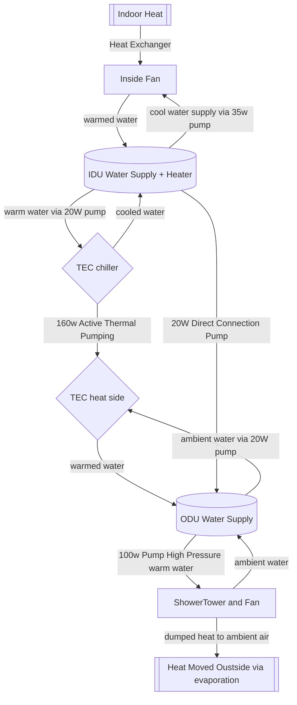

Cooling Source Options
===============

First know that you can not add coldness by adding energy.
You can only move heat away using power.

> Air Conditioners do no make cold. They move inside heat to outside, and by removing that heat, you are left with cold.

_A subtle difference in mental models that pays dividends in the long run._

## Options:

1. Phase Change Refridgerant
   - Mr Cool Mini Split
   - Signature Solar Mini Split
   - DIY Option By buying an RV Fridge - and repurposing parts

1. Evap Cooling
   - Tech Ingredients
   - Desertsun02

1. Peltier Cooling
   - Hot + Cold Loops (2x Water Pumps)
   - Hot(ODU) + Cold(IDU) Tubs
   - 4s2p config of 12706 TECs
   - So far, can achieve a 51ºF cold tub + 70ºF (∆12ºC) Hot tub (in ambient 80ºF)

1. Shower Tower
   - 24V Air Fan
   - 24V Water pump (high pressure for better atomization)

1. Ensemble
   - Peltier + Evap
   - If the Peltier can get the heat water over ambient, and the evap tower can evacuate the heat back to ambient, thne we have a net cooling effect.

