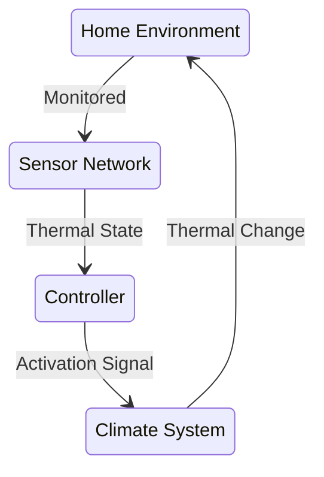
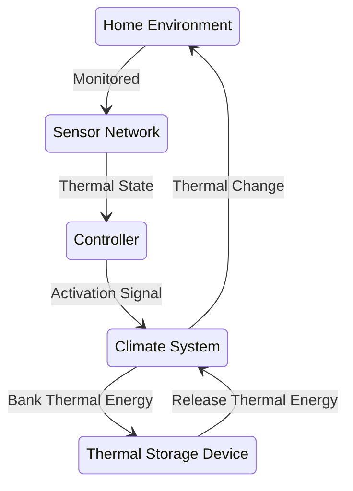

Planning Thermostat
============

Goal: Flatten the daily temp curve - softer high and lows - a low pass filter, and  

Reminder:
- BTU = 1 Pound Water * 1 Degree F @ 1 Atm =  83.3 BTU per DeltaTF for the igloo full
- Heat in Watts = Q(w) def: flow rate (kg/s) * Specific Heat Constant Cp (J/ (kg * K)) * DeltaT(C or K)
- near 
    - 1kJ
    - .3 Wh

Active Standard Climate Control

Active Planning Climate Control

## Stocks and Flows Analysis:

- Battery Storage Capacity = ~1868Wh
- Battery Inflow Rate = 200W Max
- Battery OutFlow Rate = Very High

- Igloo Thermal Storage Capacity = DeltaT (Water vs Air) * 10 Gallon Water
- Igloo Thermal Inflow Rate = Flow Rate (~18.3 GPM) * DeltaT (to ODU)
- Igloo Thermal Outflow Rate = Flow Rate (~18.3 GPM) * DeltaT (to IDU)

- IDU Thermal Dump Rate
    - DeltaT * Flow Rate
- ODU Thermal Dump Rate
    - DeltaT * Flow Rate

Constants:
- Casita ThermalMass
- Casita Insulative Properties

Considerations:
- Efficiency/ or Electrical budget vs BTU
- Pre-heat the space in prep for the "next day being cold"

Big Picture:

- Planning Vs Best Effort
    - Storing Up Energy For Tomorrow Separates the categories
    - Some notion of a weather forecast that tomorrow, or the next N days "will be tough" is required
    - https://merrysky.net/forecast/75230/json seems like a reasonable start

## Best Effort

In general a best effort off-grid system will:
- Store Electrical Power During Day then 
- Run PTC Heaters during the nighly lows
- Run a cooler during peak heat 
    - maybe even preset the water to lower temps - by running a chiller at a nightly low
- Store Run Solar Heater duging the day for cold nights 
- Run Exhaust Fans

## Planmning Systems

With a semi-trusted forecast, we can bank reserves prepping for poor conditions

- warm + cloudy = low demand = bankable day with low demand
- cold + sunny = solar furnace = bankable day with low demand (assuming use of a solar furnace)
- cold + not sunny = PTC heater + reserves?
- hot + sunny = coolers + reserves?

Bankable days create the questions: 

- "How quickly can we add to the bank?" (inflow)
- "How much can the bank hold? (capacity)
- "How long can we hold then draw from the bank, and what effect does that have on capacity" (bank leakage)
- "How quickly can we draw from the bank?" (outflow)

What is the goal of the planning system?
- Flatten the Curve?
- Doesn't that come at the cost of ignoring todays needs?
- What if the goal is error minimization?, and then the question is in which domains? time - sure, but what about extent? which is worse?
    - missing setpoint for 5 hours at 5 degress F (or)
    - missing setpoint for 1 hour by 25 degrees F
        - Its the same energy level, but the 1 hour feels more impactful