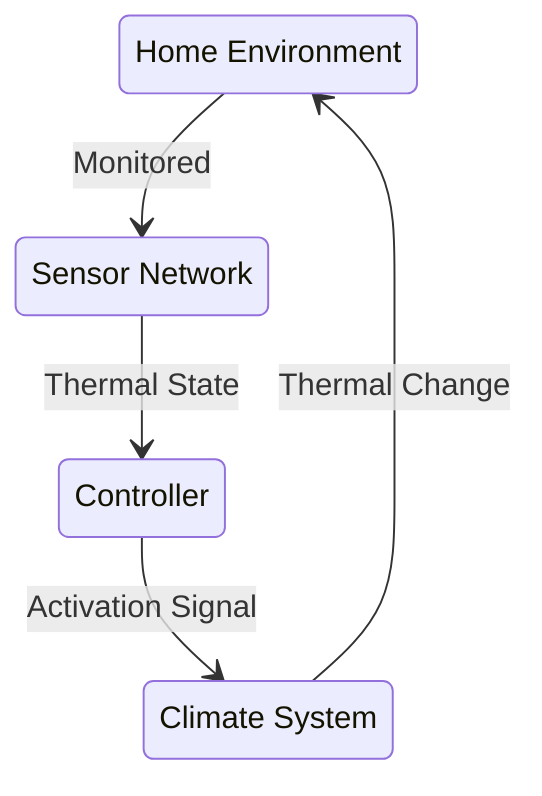
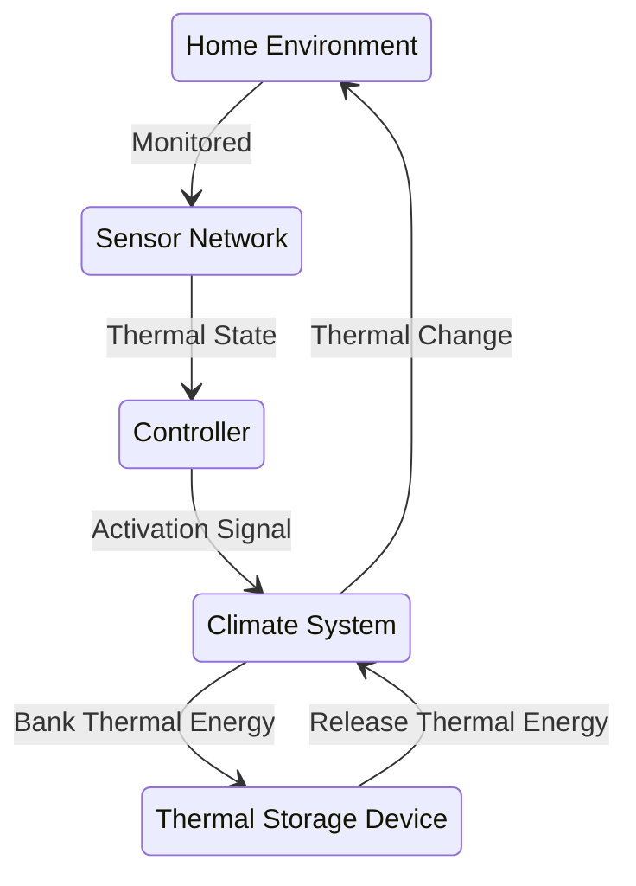

Planning Thermostat
============

Goal: Flatten the daily temp curve - softer high and lows - a low pass filter, and  

Reminder:
- BTU = 1 Pound Water * 1 Degree F @ 1 Atm =  83.3 BTU per DeltaTF for the igloo full
- near 
    - 1kJ
    - .3 Wh

Active Standard Climate Control

Active Planning Climate Control

Stocks and Flows Analysis:

- Battery Storage Capacity = ~1868Wh
- Battery Inflow Rate = 200W Max
- Battery OutFlow Rate = Very High

- Igloo Thermal Storage Capacity = DeltaT (Water vs Air) * 10 Gallon Water
- Igloo Thermal Inflow Rate = Flow Rate (~18.3 GPM) * DeltaT (to ODU)
- Igloo Thermal Outflow Rate = Flow Rate (~18.3 GPM) * DeltaT (to IDU)

- IDU Thermal Dump Rate
    - DeltaT * Flow Rate
- ODU Thermal Dump Rate
    - DeltaT * Flow Rate

Constants:
- Casita ThermalMass
- Casita Insulative Properties

Considerations:
- Efficiency/ or Electrical budget vs BTU
- Pre-heat the space in prep for the "next day being cold"

Big Picture:
- Store Electrical Power During Day
    - Run PTC Heaters during the nighly low temp
    - Run Swamp Cooler at night and release the cold-supply at the peak heat of the day

- Store Run Solar Heater duging the day for 
    - cold + sunny = solar furnace
    - cold + not sunny = PTC heater?
    - hot + cloudy = easy-ish
    - hot + sunny = 